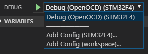

Setup a portable environment with Visual Studio Code and the Cortex-Debug extension to program & debug Cortex M devices on Windows 10.

## **Installing the tools**
Download and install the following tools  
* Visual Studio Code

* GNU Arm compiler   
  https://gnu-mcu-eclipse.github.io/toolchain/arm/  
  or  
  https://github.com/gnu-mcu-eclipse/arm-none-eabi-gcc/releases

* OpenOCD  
  http://gnutoolchains.com/arm-eabi/openocd/ 

* msys      (has the make tools etc)

I'm always using the zipped versions to have a 'portable' installation.  
Just extract the zip's in the folders mentioned below

```
C:\VSCodeTest\Tools\GNUArm  
C:\VSCodeTest\Tools\msys  
C:\VSCodeTest\Tools\OpenOCD  
C:\VSCodeTest\vscode
```

## **Create start batch file**
Create a batch file in the C:\Tools folder called **start.bat**.  
As we want to create a portable version we have to tell vscode where to store its settings and extensions.  
Create a folder called **C:\Tools\vsc_userdata** where the settings etc from vscode will be stored.  
Create a folder called **C:\VSCodeTest\vscode\extensions** where vsc will store the installed extensions.

Put the next code in the start.bat file  
``` bat
echo off  
start vscode\Code.exe --extensionHomePath %CD%\vscode\extensions  --user-data-dir=%CD%\vsc_userdata
```
This will tell vscode were to find the alternative paths to use.

Start vscode by double clicking the start.bat file.  
Install the next extensions in vscode.  
* C/C++  
* Cortex-Debug  
Close VSCode

Edit **start.bat** and add the following
``` bat
echo off
set TOOLSROOT=%CD%\TOOLS
set GNUARM=%TOOLSROOT%\GNUArm
set MSYS=%TOOLSROOT%\msys\1.0
set OPENOCD=%TOOLSROOT%\OpenOCD
start vscode\Code.exe --extensionHomePath %CD%\vscode\extensions  --user-data-dir=%CD%\vsc_userdata
```
This will set some environment variables we are going to use so the extensions can find the tools needed.

Start vscode again by double clicking the start.bat file.  
We are using a STM32F4-Discovery board to test the environment.  
A simple project can be found in this repository.   
Put the project in c:\Projects\STM32F4.     
In the menu select **File\Open Folder ...** and select the folder containing the project in the dialog.

## **Add tasks for building & cleaning the projects**

Next step is to add a task to compile the project.  
* Press F1 and type\select Tasks: Configure Task  
* Select Create tasks.json file from template  
* Others Example to run an arbitrary external command  


We will add a clean and a build task.  
Add the json text below to the tasks.json.

``` json
{  
    "version": "2.0.0",
    "type":"process",    
    "presentation": {
        "echo": true,
        "reveal": "always",
        "focus": false,
        "panel": "dedicated"
    },
    "windows": {
        "options": {
            "env": { "Path":"${env:MSYS}/bin;${env:GNUARM}/bin;${env:OPENOCD}/bin;%Path%" }
        }
    },
    "tasks": [
        {
            "label": "build",
            "windows": {
                "command": "make.exe",
                "args": [
                    "DEBUG=GDB"
                ]
            },
            "group": {
                "kind": "build",
                "isDefault": true
            },
            "problemMatcher":{
				"base": "$gcc",
				"fileLocation": "relative"
			}
        },
        {
            "label": "clean",
            "windows": {
                "command": "make.exe",
                "args": [
                    "clean"
                ]
            },         
            "problemMatcher": []
        }
    ]
}
```
<span style="color:red">**TODO: explain what the json above is for**</span>  

Now we have 2 tasks.  
Press F1 and type Tasks: Run Task and select build.  
In the vscode terminal pane the output from the compiler will be visible.

<span style="color:red">**TODO: troubleshooting**</span>  

### **Add a launch.json file** 
Press F1 and type launch and select **Debug:Open launch.json** and select **Cortex Debug**. A template launch.json will open.  
Copy the json below into the open launch.json.  


``` json
{
    "version": "0.2.0",
    "configurations": [        
        {
            "type": "cortex-debug",
            "request": "launch",
            "servertype": "openocd",
            "name": "Debug (OpenOCD)",
            "cwd": "${workspaceRoot}",
            "executable": ".\\build\\${workspaceFolderBasename}.elf",
            "device":"STM32F407VG",
            "svdFile": "${workspaceRoot}/../vsd/STM32F407.svd",
            "showDevDebugOutput": false,
            "configFiles": [
                "${env:OPENOCD}/scripts/board/stm32f4discovery.cfg"
            ],
            "runToMain": true,
            "preLaunchTask": "build"
        }
    ]
}
```

<span style="color:red">**TODO: explain what the json above is for**</span>   

Also the path to the toolchain and openocd must be added to the cortex-debug settings.  
It looks like this can only be added to a workspace settings.json.   
Create a workspace by selecting the menu **File\Save workspace as ...** select a name and press save.   
Now select the menu **File\Preferences\Settings** or press **Ctrl+,**.   
Select **Workspace Settings** and add the following to the "settings" key for the json.
``` json
{
	"folders": [
		{
			"path": "STM32F4"
		}
	],
	"settings": {    
		"cortex-debug.armToolchainPath": "${env:GNUARM}/bin",
		"cortex-debug.openocdPath": "${env:OPENOCD}\\bin\\openocd.exe"
	}

}
```

Now we can start a debug session.  
Select the debug icon  on the left or press Ctrl+Shift+D.  
Select the correct debug configuration **Debug (OpenOCD) (STM32F4)** from the dropdown box 
 .  
Press the 'play' icon and debugging will start..

<span style="color:red">**TODO: troubleshooting**</span>
